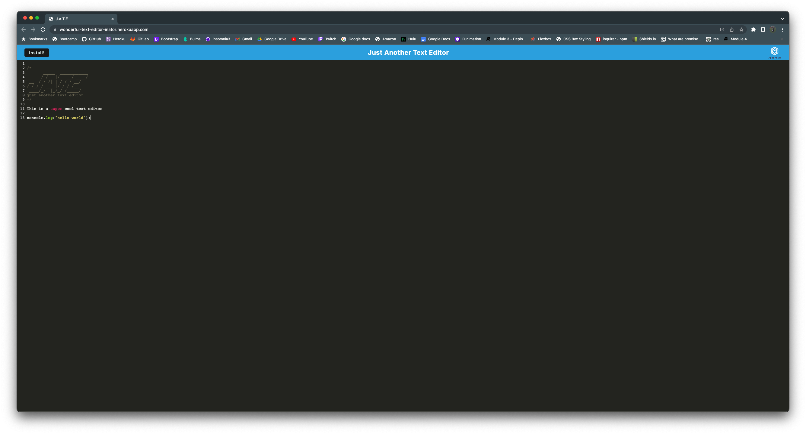
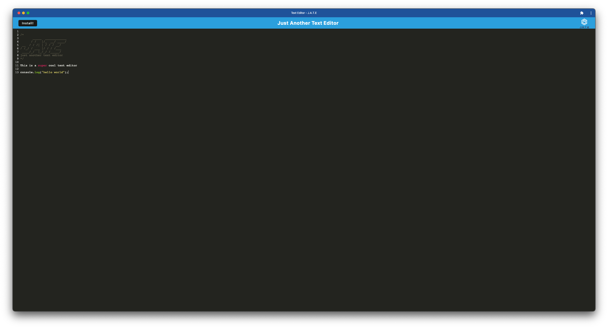

# Tech-Blog
  
  [Chris Cavazos](https://github.com/cavazosdotcom)
  
# Description

Having been given the code for a text-editor, I created the ability to use this application as a PWA. Through using webpack and its workbox plugins with css and html loaders, I can create a bundled version of the text-editor to be downloaded as a PWA. Babel let's the app use ES6 syntax on older ES5 browsers. With the use of IDB we also have persisting data whether we decide to run the app, online or offline and though the browser or on the PWA.

Browser:


PWA:


# Table of Contents

* [Links](#links)

* [Installation](#installation)

* [Usage](#usage)

* [License](#license)

* [Technologies](#technologies)

* [Tests](#tests)

* [Questions](#questions)
  

# Links

[Github Repo URL](https://github.com/cavazosdotcom/text-editor)

The User can fork this repository to run the application locally and follow the insallation instructions below... or use the heroku deployed version here:

[Heroku Deployed URL](https://wonderful-text-editor-inator.herokuapp.com/)

# Installation

To install necessary dependencies after cloning the repository, run the following command into this repo's terminal:

```bash
npm i
```

then build the application

```bash
npm run build
```
# Usage

You must have `node.js` installed to run the application. Once installed, run the command through your terminal to start the local server on your local host: [http://localhost:3000/](http://localhost:3000/):


```md
npm start
```


# License

This project does not have a license


# Technologies

Node.js

Babel

Webpack

NPM Packages
```
concurrently
nodemon
```

Server-Side NPM Packages
```
express
```

Client-Side Npm Packages
```
code-mirror-themes
idb
```
# Tests

There are currently no tests on this application

# Questions
If you have any questions feel free to contact me at either [Github](https://github.com/cavazosdotcom), or [cavazosdotcom@gmail.com](cavazosdotcom@gmail.com)  
